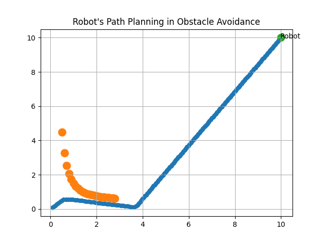

# Obstacle Avoidance Algorithm in C++
- [Obstacle Avoidance Algorithm in C++](#obstacle-avoidance-algorithm-in-c)
  - [Description](#description)
  - [Usage](#usage)
  - [Technologies](#technologies)
  - [Setup](#setup)
  - [Roadmap](#roadmap)
  - [References](#references)
  - [License](#license)

## Description
This library is about path planning for a mobile robot to reach its destination by avoiding obstacles resulting in a safe navigation as an optimal path.

## Usage
A comprehensive example:
```c++
#include <iostream>
#include "functionsRepandAtt.h"
#include "matplotlibcpp.h"
#include "ObstacleAvoidanceConfig.h"

using namespace std;
namespace plt = matplotlibcpp; // Importing matplotlib-cpp

int main(int argc, char *argv[])
{
    // position of target
    float goalCoordinates[2] = {10, 10};

    // initial position of robot
    float robotCoordinates[2] = {0, 0};

    // number of obstacles
    int   nObstacles = 24;
    float obstaclex[nObstacles];
    float obstacley[nObstacles];
    float obstaclexf = 0.7f;

    // Creation of custom obstacles
     for (int i = 0; i < nObstacles; i++)
    {
      obstacley[i] = (pow((1 / obstaclexf), 2) + 0.5);
      obstaclex[i] = obstaclexf;
      obstaclexf += 0.1;
    }

    // Parameters as described in detail in the library obstacleAvoidance
    float params[6] = {1.1, 100, 0.2, 1, 2, float(nObstacles)};

    // Obstacle Avoidance possible Error object creation as err
    o_errt err;

    // Object creation for the calculation context as ctx
    OcalculationContext *ctx = new OcalculationContext;

    // Creation of object for the Result as res
    Oresult *res = new Oresult;

    // Creation of object for Forces as force
    Forces force;

    // Function for initialization of parameters to run the program as explained in the library obstacleAvoidance
    err = obaInitCalculationContext(goalCoordinates, robotCoordinates, params, obstaclex, obstacley, ctx);
    if (err != o_errt ::err_no_error)
    {
      cout << "Error detected";
    }

    // Function takes the Results obtained from functionsRepandAtt to check errors
    err = obaInitResult(res);
    if (err != o_errt ::err_no_error)
    {
      cout << "Error detected";
    }

    // for plotting purposes using matplotlib
    vector<float> xR; // x-coordinate of robot
    vector<float> yR; // y-coordinate of robot
    vector<float> obsx; // x-coordinate of obstacles
    vector<float> obsy; // y-coordinate of obstacles

    for (int i = 0; i < params[5]; i++)
    {
      obsx.push_back(obstaclex[i]);
      obsy.push_back(obstacley[i]);
    }
    vector<float> goalx = {ctx->xGoal};
    vector<float> goaly = {ctx->yGoal};
    plt::figure();

    // while robot not yet reached the target
    while ((ctx->xRobot, ctx->yRobot) != (ctx->xGoal, ctx->yGoal))
   {
      err = force.forceAtt(ctx, res); // Calculate attraction force between the robot and target
      err = force.forceRep(ctx, res); // Calculate force of repulsion between the Robot and the obstacles
      err = force.forceComp(ctx, res); // Calculate the total force by adding the corresponding components of attraction & repulsion forces
      err = force.forceAngle(ctx, res); // Calculate the steering angle for direction (navigation) using total force components
      err = force.nextStep(ctx, res); // Calculate the next step for the robot consisting of x and y coordinates as its position
      xR.push_back(ctx->xRobot); // for plotting purpose
      yR.push_back(ctx->yRobot); // for plotting purpose
      plt::plot(xR, yR); 
      plt::scatter(xR, yR);
      plt::annotate("Robot", ctx->xRobot, ctx->yRobot);
      plt::scatter(obsx, obsy, 'r');
      plt::scatter(goalx, goaly, 'g');
      plt::grid(true);
      plt::title("Robot's Path Planning in Obstacle Avoidance");
      plt::show();
   }

   return 0;
}
```
**Result:**


## Technologies
Project is created with:
* C++
* CMake

## Setup
To run this project
* Install CMake with a minimum version of 3.10
* Add libraries [functionsRepandAtt](ObstacleAvoidance/src/include/functionsRepandAtt.h) and [obstacleAvoidance](ObstacleAvoidance/src/include/obstacleAvoidance.h)
* Install [Matplotlib-cpp](https://github.com/lava/matplotlib-cpp) which is a very easy to use C++ plotting library for plotting and visualization purposes.


## Roadmap
- [x] Robot avoids random stationary obstacles (static environment) as version 1.0
- [ ] Robot avoids random moving obstacles (dynamic environment) as version 1.1
- [ ] Implementation of interpolation functions and control strategies to calculate optimal path like shortest distance and time as version 2.0


## References
* [Obstacle avoidance of mobile robots using modified artificial potential field algorithm](https://doi.org/10.1186/s13638-019-1396-2)

* [Path planning for autonomous mobile robot using the Potential Field method](https://doi.org/10.1109/ASET.2017.7983725)

## License
[MIT](https://choosealicense.com/licenses/mit/)


Thanks for visiting :v:

