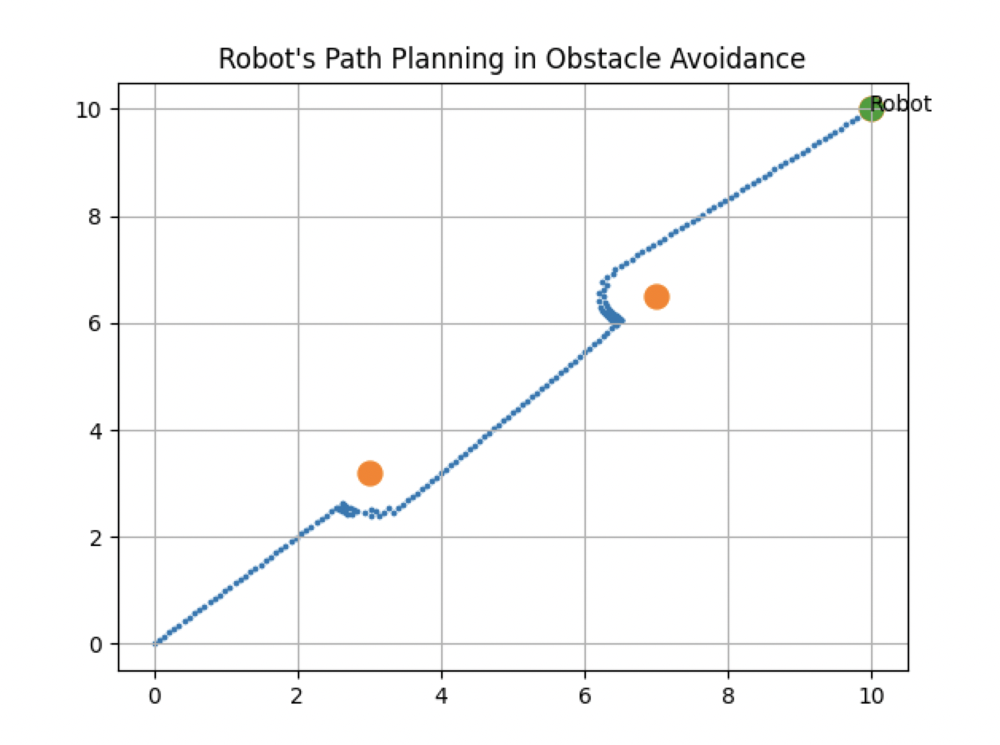
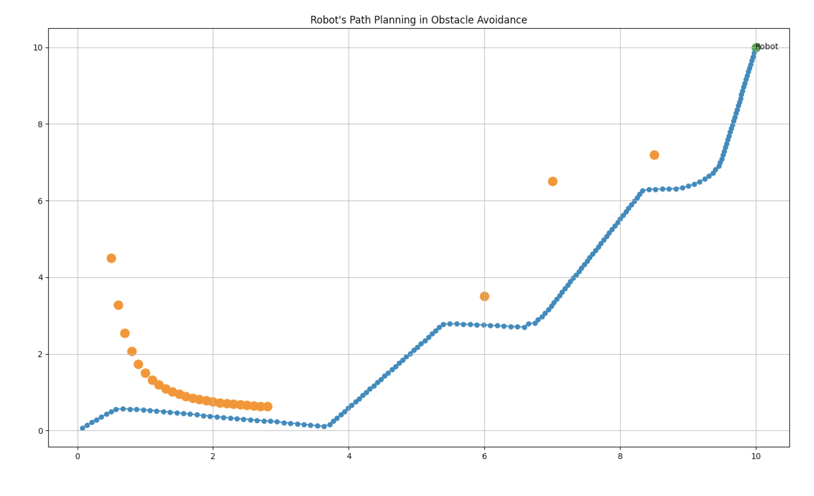

# Obstacle Avoidance Algorithm in C++ (Version 2.2)
- [Obstacle Avoidance Algorithm in C++ (Version 2.2)](#obstacle-avoidance-algorithm-in-c-version-22)
  - [Description](#description)
  - [Usage](#usage)
  - [Demo](#demo)
  - [Technologies](#technologies)
  - [Setup](#setup)
  - [Roadmap](#roadmap)
  - [References](#references)
  - [License](#license)

## Description
This library is about path planning for a mobile robot to reach its destination by avoiding obstacles resulting in a safe navigation as an optimal path.

## Usage
A comprehensive example:
```c++
#include <iostream>
#include "functionsRepandAtt.h"
#include "matplotlibcpp.h"
#include "ObstacleAvoidanceConfig.h"

using namespace std;
namespace plt = matplotlibcpp; // Importing matplotlib-cpp

int main(int argc, char *argv[])
{
   float goalCoordinates[2] = {10, 10};               // Position of target
   float robotCoordinates[2] = {0, 0};                // Initial position of robot
   const int nObstaclesTotal = 2;                     // Number of obstacles
   float obstaclex[nObstaclesTotal] = {3, 7};         // Obstacles X-coordinate positions
   float obstacley[nObstaclesTotal] = {3.2, 6.5};     // Obstacles Y-coordinate positions
   o_envType_t envType = env_stationary;              // Obstacle environment type stationary

   // Paramters as explained in obstacleAvoidance
   float params[6] = {1.1, 100, 0.1, 0.75, 2, float(nObstaclesTotal)};

   // As explained in corresponding libraries
   // Obstacle Avoidance possible Error object creation as err
   o_err_t err;

   // Object creation for the calculation context as ctx
   OcalculationContext *ctx = new OcalculationContext;

   // Creation of object for the Result as res
   Oresult *res = new Oresult;

   // Creation of object for Forces as force
   Forces force;

   // Function for initialization of parameters to run the program as explained in the library obstacleAvoidance
   err = oba_Init_CalculationContext(goalCoordinates, robotCoordinates, params, obstaclex, obstacley, ctx);
   if (err != o_errt ::err_no_error)
   {
      cout << "Error detected";
   }

   // Function takes the Results obtained from functionsRepandAtt to check errors
   err = oba_Init_Result(res);
   if (err != o_errt ::err_no_error)
   {
      cout << "Error detected";
   }
   vector<float> xR = {robotCoordinates[0]};                              // X-coordinate of robot
   vector<float> yR = {robotCoordinates[1]};                              // Y-coordinate of robot
   vector<float> xObs = {obstaclex[0], obstaclex[1]};                     // X-coordinate of obstacles
   vector<float> yObs = {obstacley[0], obstacley[1]};                     // Y-coordinate of obstacles
   vector<float> goalx = {ctx->xGoal};                                    // X-coordinate of target
   vector<float> goaly = {ctx->yGoal};                                    // Y-coordinate of target

   if (ctx->envType = env_stationary)
   {
      while ((res->oResultNextX, res->oResultNextY) != (goalCoordinates[0], goalCoordinates[1]))
      {
         err = force.force_Att(ctx, res);   // Calculate attraction force between the robot and target
         err = force.force_Rep(ctx, res);   // Calculate force of repulsion between the Robot and the obstacles
         err = force.force_Comp(ctx, res);  // Calculate the total force by adding the corresponding components of attraction & repulsion forces
         err = force.force_Angle(ctx, res); // Calculate the steering angle for direction (navigation) using total force components
         err = force.next_Step(ctx, res);   // Calculate the next step for the robot consisting of x and y coordinates as its position

         xR.push_back(res->oResultNextX);        // For plotting purpose
         yR.push_back(res->oResultNextY);        // For plotting purpose
         plt::scatter(xR, yR, 3);
         plt::annotate("Robot", ctx->xRobot, ctx->yRobot);
         plt::scatter(xObs, yObs, 'r');
         plt::scatter(goalx, goaly, 'g');
         plt::grid(true);
         plt::title("Robot's Path Planning in Obstacle Avoidance");
         plt::show();
      }
   }
   cout << argv[0] << " VERSION " << OBSTACLEAVOIDANCE_VERSION_MAJOR << "." << OBSTACLEAVOIDANCE_VERSION_MINOR << endl;
   return 0;
}
```
**Result:**


## Demo

 

## Technologies
Project is created with:
* C++
* CMake

## Setup
To run this project
* Install CMake with a minimum version of 3.10
* Add libraries [functionsRepandAtt](ObstacleAvoidance/src/include/functionsRepandAtt.h) and [obstacleAvoidance](ObstacleAvoidance/src/include/obstacleAvoidance.h)
* Install [Matplotlib-cpp](https://github.com/lava/matplotlib-cpp) which is a very easy to use C++ plotting library for plotting and visualization purposes.


## Roadmap
- [x] Robot avoids random stationary obstacles (static environment) as version 1.0
- [ ] Robot avoids random moving obstacles (dynamic environment) as version 2.0
   - [x] Dynamic environment with obstacles moving along a linear path version 2.1
   - [x] Dynamic environment with obstacles moving along a quadratic path version 2.2
   - [ ] Dynamic environment with obstacles moving along a cubic path version 2.3
- [ ] Implementation of interpolation functions and control strategies to calculate optimal path like shortest distance and time as version 3.0


## References
* [Obstacle avoidance of mobile robots using modified artificial potential field algorithm](https://doi.org/10.1186/s13638-019-1396-2)

* [Path planning for autonomous mobile robot using the Potential Field method](https://doi.org/10.1109/ASET.2017.7983725)

## License
[MIT](https://choosealicense.com/licenses/mit/)


Thanks for visiting :v:
